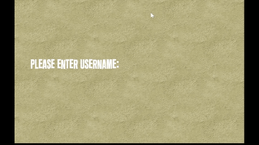

# Target Practices Gameplay

Target gamemode, shoot all the targets before the timer goes out to show you stats

# Enemy Gameplay

Enemys will roam and fire on you if you enter its detection cone

# Fuel UI

Fuel gauge will continuously go down until fuel is picked up

# Repair Feature

Turret Will have chance to break, making the turret rotate uncontrollably until R is pressed enough times 

